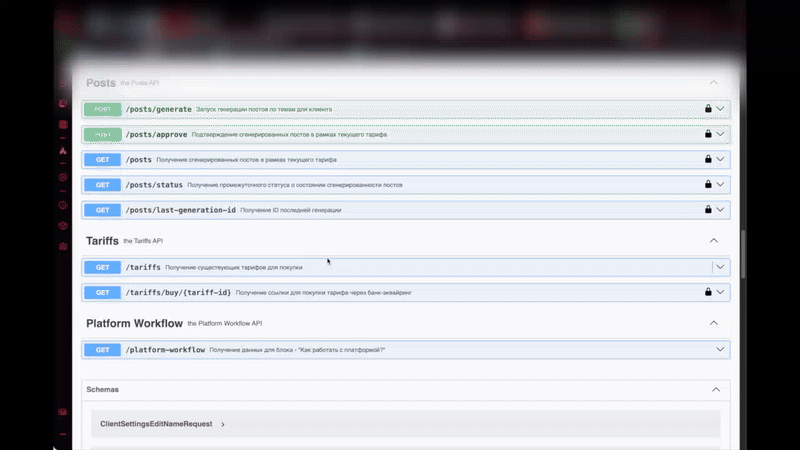
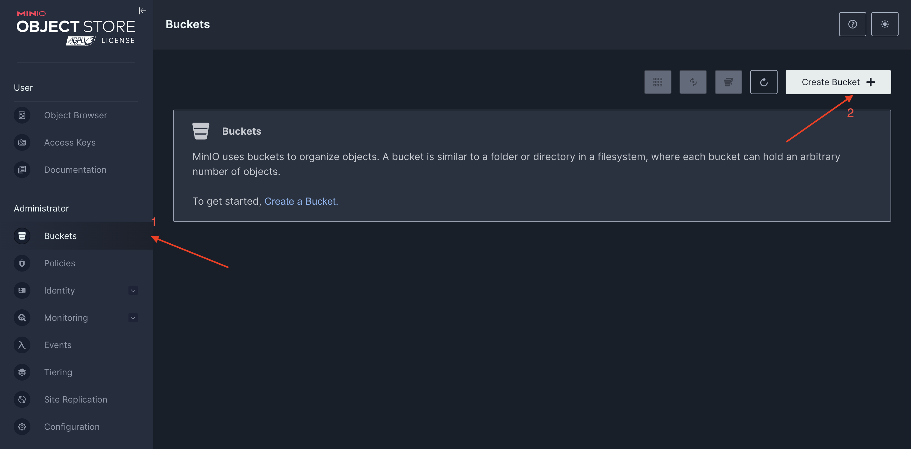
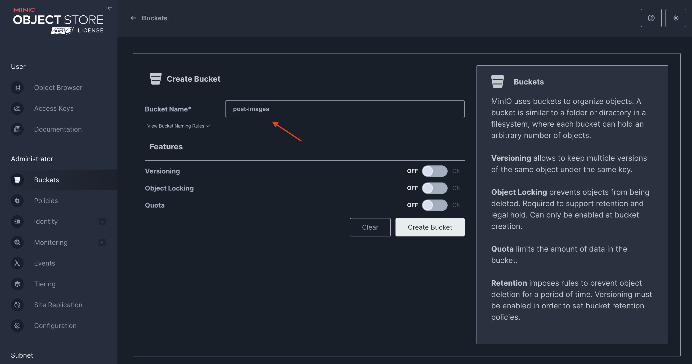

# 🤖 SocialNetwork AI

## About

**Short functionality demo:**

| Tariff purchase                                       | Post generation                                       | Post publication                                        |
|-------------------------------------------------------|-------------------------------------------------------|---------------------------------------------------------|
|  |  |  |

- **Monetization model**: Paid monthly subscription 
- **Short description:** Server application that automates the creation of publications for social networks through the use of artificial intelligence

### Technologies

* Language: **Java, SQL**
* Technologies: **Spring Framework, OpenAPI Generator, Quartz, Liquibase**
* Database: **PostgreSQL, Minio S3, Prometheus**
* Monitoring: **Grafana**
* Deploy: **Docker**
* API: **ChatGPT** _(text generation)_, **Kandinsky** _(image generation)_, **Yookassa** _(payment acceptance)_

## Installing

### Clone the project

```shell
git clone https://github.com/l1ve4code/social-network-ai.git
```

### Set your values in docker-compose.yml or docker-compose-local.yml

_(For example: username, password and etc, or **use defaults**)_

```yaml
    postgres:
        container_name: postgres_container
        image: postgres:16-alpine
        ports:
          - "5432:5432"
        environment:
            POSTGRES_USER: <user>
            POSTGRES_PASSWORD: <password>
        volumes:
          - pg-data:/var/lib/postgresql/data
        restart: unless-stopped

    minio:
        container_name: minio_container
        image: minio/minio:RELEASE.2024-06-13T22-53-53Z
        command: server --console-address ":9001" /data/
        ports:
            - "9000:9000"
            - "9001:9001"
        restart: on-failure
        environment:
            MINIO_ROOT_USER: <user>
            MINIO_ROOT_PASSWORD: <password>
        volumes:
          - minio-storage:/data
```

### Replace the gaps in the config with your values

_(Properties path: src/main/properties.d/production.properties)_

```properties
application.host.address=<host-address>

spring.datasource.url=jdbc:postgresql://<host>:5432/<dbname>
spring.datasource.username=<username>
spring.datasource.password=<password>
spring.datasource.driver-class-name=org.postgresql.Driver

minio.user.name=<username>
minio.user.password=<password>

spring.mail.username=<username>
spring.mail.password=<password>

external.api.yookassa.id=<id>
external.api.yookassa.secret=<secret>
```

### Project startup _(using IDE)_

**Firstly**, you need to **run docker compose**

```shell
docker compose -f docker-compose-local.yml up -d
```

**Secondly**, you need to **run mvn**

```shell
mvn clean compile
```

Then you need to start the **Java project** using **your IDE**

### Project startup _(using Docker)_

Just run this command and project will be built and launched automatically

```shell
docker compose up -d
```

### Create Minio S3 bucket

Log in to the Minio graphical interface using this link and credentials from **docker-compose.yml** _(or **docker-compose-local.yml**)_

```markdown
<your-ip>:9001 (example: localhost:9001)
```

Follow the steps sequentially based on the images



As bucket name use **post-images** 



Good luck ✨

## Author

* Telegram: **[@live4code](https://t.me/live4code)**
* Email: **steven.marelly@gmail.com**